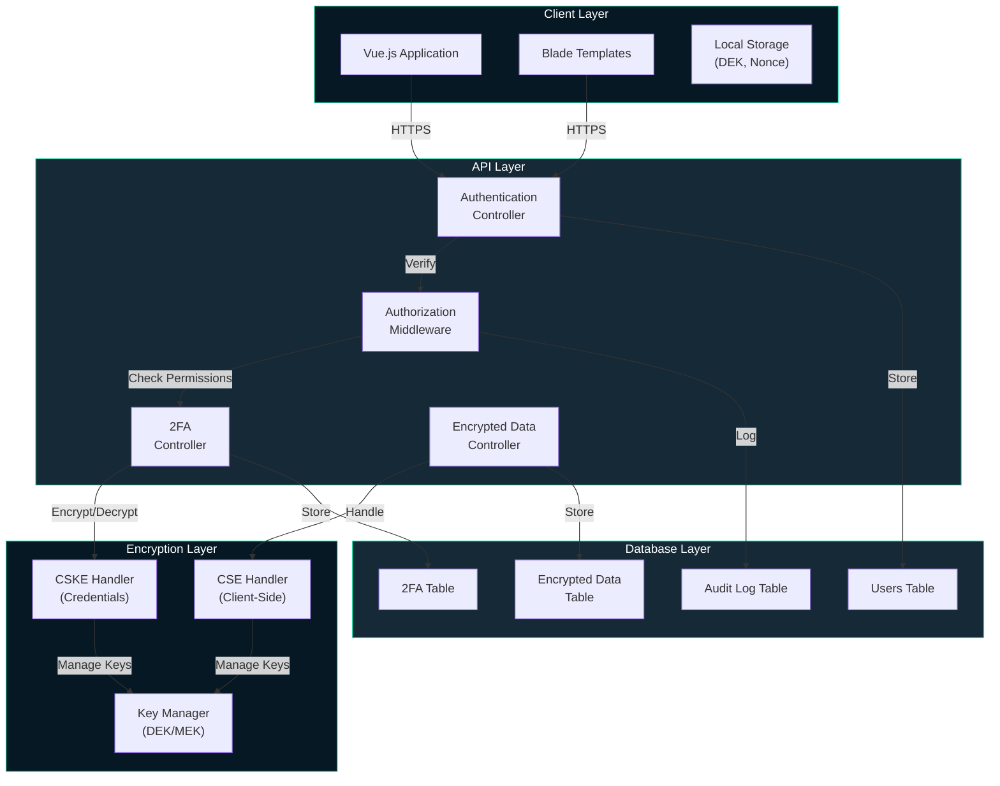
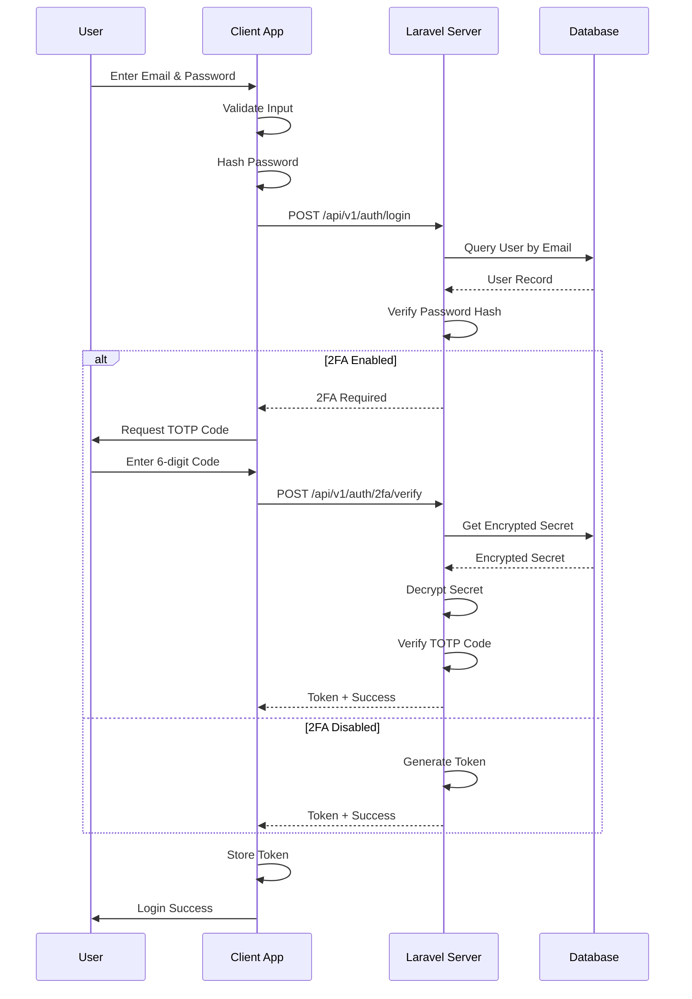
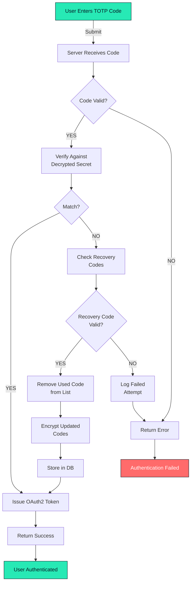
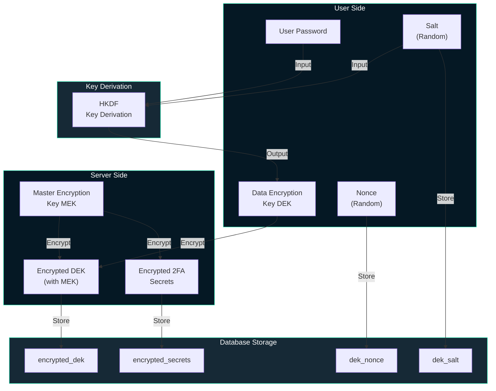
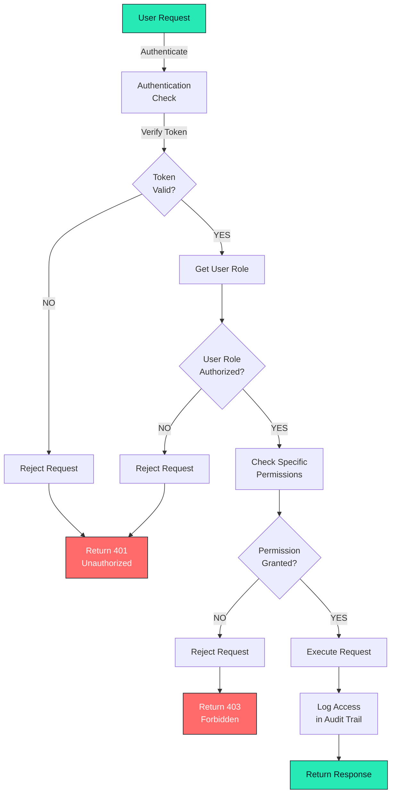
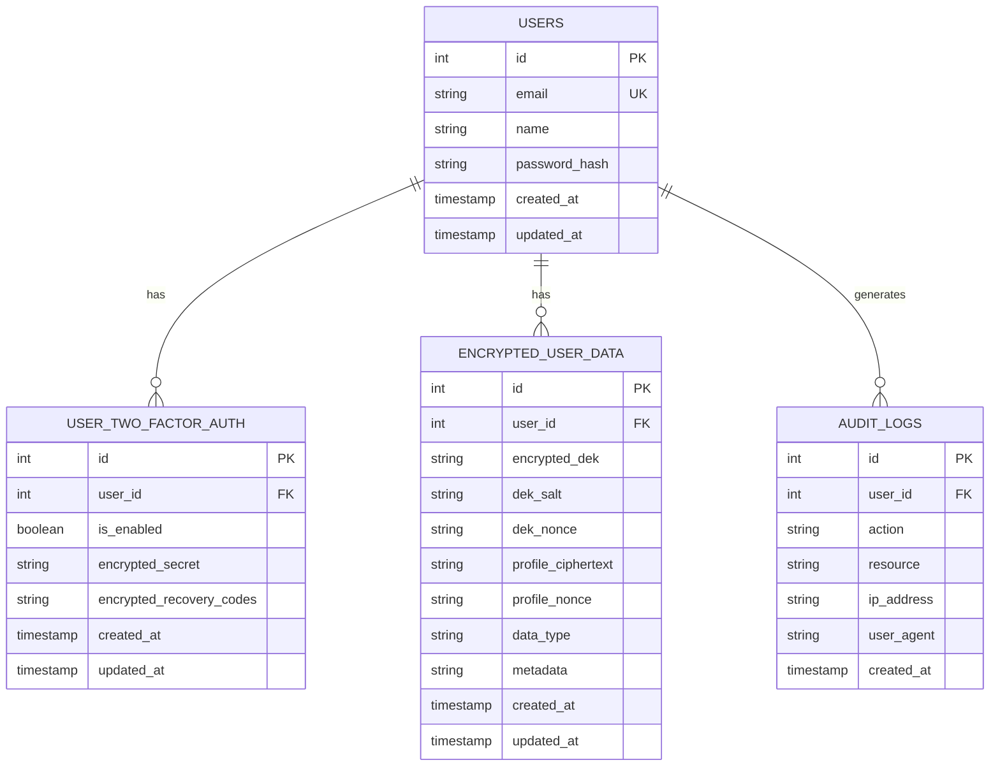
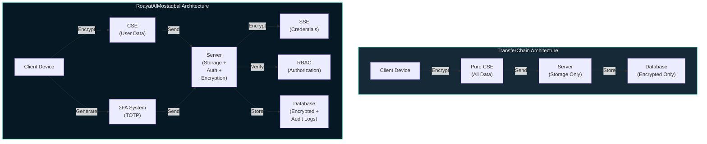
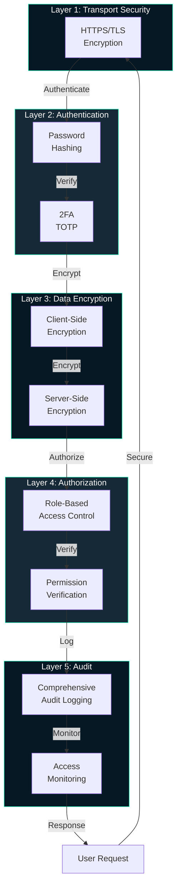
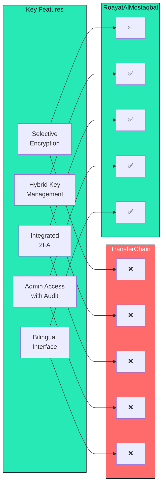

# Architecture Diagrams
## RoayatAlMostaqbal - Detailed System Architecture with Mermaid Diagrams

**Document Purpose:** Visual representation of system architecture, data flows, and component relationships using Mermaid diagrams.

**Date:** November 2025
**Status:** Patent Examination Support Document

---

## DIAGRAM 1: System Component Architecture

---

## DIAGRAM 2: Authentication Flow

---

## DIAGRAM 3: Data Encryption Flow

```mermaid
graph LR
    subgraph Client["Client Side"]
        UserData["User Profile<br/>Data"]
        GenDEK["Generate DEK<br/>(Locally)"]
        DeriveKey["Derive Key<br/>(HKDF)"]
        Encrypt["Encrypt Data<br/>(AES-256)"]
        Payload["Create Payload<br/>(encrypted_dek,<br/>ciphertext)"]
    end
    
    subgraph Network["Network"]
        HTTPS["HTTPS<br/>Transmission"]
    end
    
    subgraph Server["Server Side"]
        Receive["Receive<br/>Encrypted Payload"]
        Validate["Validate<br/>Structure"]
        Store["Store in<br/>Database"]
        NoDecrypt["NO Decryption<br/>on Server"]
    end
    
    UserData -->|Input| GenDEK
    GenDEK -->|Generate| DeriveKey
    DeriveKey -->|Derive| Encrypt
    Encrypt -->|Output| Payload
    Payload -->|Send| HTTPS
    HTTPS -->|Receive| Receive
    Receive -->|Verify| Validate
    Validate -->|Store| Store
    Store -->|Maintain| NoDecrypt
    
    style Client fill:#051824,stroke:#27e9b5,color:#fff
    style Network fill:#162936,stroke:#27e9b5,color:#fff
    style Server fill:#051824,stroke:#27e9b5,color:#fff
```

---

## DIAGRAM 4: 2FA Verification Flow

---

## DIAGRAM 5: Key Management Architecture

---

## DIAGRAM 6: Role-Based Access Control

---

## DIAGRAM 7: Database Schema Relationships

---

## DIAGRAM 8: Comparative Architecture - TransferChain vs RoayatAlMostaqbal

---

## DIAGRAM 9: Security Layers

---

## DIAGRAM 10: Innovation Comparison Matrix

---

**Document Status:** Complete
**Version:** 1.0
**Date:** November 2025
**Ready for:** Patent Examination

